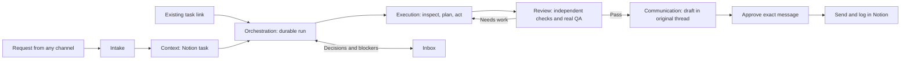

# Otto plan

Otto is one place to capture, run, review, and communicate work. Notion is the source of truth for tasks, skills, decisions, evidence, and actual time. A task uses only the steps it needs.

## Flow

Quick help stays in a personal chat. A deliverable or external commitment becomes a task.

## The six loops

| Loop | Job |
| --- | --- |
| **Intake** | Capture requests from messages, email, meetings, forms, or direct chat. Preserve the original content and channel details. |
| **Context** | Create or enrich a concise Notion task with the desired outcome, source thread, relevant history, assets, and repo when useful. Keep the solution open. |
| **Orchestration** | Start and resume a durable run, coordinate dependencies, route decisions and approvals, and keep the task moving. No standing PM agent is required. |
| **Execution** | Inspect, write a proportional plan and independent “done” checks before acting, execute, self-check, and attach evidence. Use milestones for complex work. |
| **Review** | Fresh context checks the artifact and real outcome. Record findings in Notion, send failures back for repair, and repeat until accepted or a limit is reached. |
| **Communication** | Draft the right update for the right people in the original channel, obtain required approval, send, confirm delivery, and comment on the Notion task. |

## Operating rules

- Start with “create a task from this” or “work on this” plus a source or task link. The system chooses the steps and agent profile. No agent selector is required.
- A task is a short brief plus natural-language bullets. Keep the original message or meeting link and conversation ID so the reply goes to the right place.
- Run independent tasks in parallel. Sequence work that changes the same code, document, account, or other shared resource.
- The executor leaves a short handoff: result, checks run, evidence, open issues, and actual work time. Reviewers have fresh context and can use browser or computer use to test behavior.
- Failed review creates corrective work automatically. Escalate only when a decision, missing access, or time or cost limit blocks progress.
- Review depth follows impact. Consequential plans, changes, and deployments need approval when appropriate. Every external message needs approval of its exact text, recipients, channel, and attachments before sending.
- Log actual work time, never agent runtime. Notion records progress, evidence, review, time, and who received the final update. Otto keeps run history without becoming a second task list.

## Shared capabilities

Notion and search; durable sessions; agents with role profiles, models, tools, skills, and limits; skills; automations; workflows; channel and app connections; remote computer use; artifacts; an action inbox; exact-action approvals; collaboration; permissions; and an audit trail. Inbox and sessions must work on mobile. Runs must recover after interruption without duplicate tasks or sends.

## Build path

1. **Run the fork.** Build BB from this repo and run it on the server beside the npm-installed BB. Pair it with BB Connect and use the official BB apps. Replace the npm-installed BB once the fork works end to end.
2. **Hide the noise.** Hide the core surfaces we do not use, such as the built-in browser, and disable unused built-in plugins. Remove only what gets in the way.
3. **Prove one full run.** Build Otto as one plugin with its own page (`plugins/otto`). Start from a Notion task link, plan, execute, review, repair, update Notion, draft in the original thread, approve, and send. Make the run visible in the Otto inbox.
4. **Expand intake and coverage.** Add email, WhatsApp, meetings, and other sources one at a time. Apply the same run to coding, marketing, and other work. Track failures and improve skills and checks from real cases.

## Base decision

Otto is our work system, built as plugins on a soft fork of [BB](https://github.com/get-bb/bb) (MIT). The app keeps BB's name, so upstream merges stay clean and BB Connect, the BB apps, push, and the machine installer keep working. We compared BB, Orca, T3 Code, Synara, and Craft Agents in September 2026. We also tried renaming BB to Otto and forking T3 Code, then deleted both trials. A full rename cost us clean upstream merges and BB's hosted services, so we went back to a soft fork.

- **BB** runs Claude Code and Codex on our subscriptions, supports multiple machines, mobile, push, workflows, automations, and computer use, and is already our daily tool. Its code is well tested and organized by domain, and most features are removable plugin folders. Upstream ships one squash-merged PR per commit, so changes are easy to track.
- **Orca** was too large (about 2M lines) and too fast-moving to maintain.
- **T3 Code** has the cleanest codebase, the strongest durable run design, device pairing auth, and a polished native mobile app, but no plugins, workflows, automations, or dispatch across machines.
- **Synara** is derived from T3 Code and mostly built by one developer. It is early-stage, desktop-first, and has no mobile app.
- **Craft Agents** is the smallest and closest to non-code work, but its public repo is a release mirror and it has no mobile app.

### What we borrow

- **T3 Code:** the idempotent command and event pattern for durable runs.
- **Synara** (MIT): automations, handoffs between providers, and scoped MCP access for other local clients.
- **Craft Agents** (Apache-2.0, keep its NOTICE attribution): the messaging gateway, the WhatsApp worker, sources such as Notion and Linear, and the inbox.

### Fork rules

- `origin` is `hellogafaro/bb` (private). `upstream` is `get-bb/bb` with pushing disabled. GitHub Actions are disabled on the repo because the inherited workflows deploy and publish BB.
- Keep BB's names, packages, env vars, and protocol. Never rename them; Otto is a set of plugins and settings, not a new product name.
- An agent merges all of upstream weekly and opens a PR with a summary, test results, and any conflicts. We approve the merge.
- Keep Otto code in new files and folders (`plugins/otto`, this plan). Keep core edits small and rare. Hide features with settings instead of deleting core files.
- Never edit the provider plugins (`provider-claude-code`, `provider-codex`), the provider bridge packages, or the connect and tunnel packages. Upstream keeps our subscriptions working.
- Offer generic patches, such as hiding core surfaces, upstream. Drop each one from the fork when upstream accepts it.
- Before copying code from a community plugin or another project, check that its license allows it and keep the required notices.

### Runtime

- **Server:** this Linux server, on the `hellogafaro.com` tailnet as `server.garibaldi-mermaid.ts.net`.
- **Remote access:** BB Connect (getbb.app) for browsers, the BB apps, and machines, plus Tailscale Serve over HTTPS on the tailnet. Never use Funnel or bind BB to a public address, because its API has no login of its own.
- **Machines:** add `pro` and `neo` from Settings → Machines.
- **Mobile:** the official BB iOS app, paired through BB Connect. Push goes through Expo and needs no Apple or Google keys. On the phone, Otto focuses on the inbox: notifications, approvals, answers, and run status.
- **Telemetry:** set `BB_TELEMETRY=false`.

## References

Study these when a specific mechanism is needed: [Companion](https://github.com/The-Vibe-Company/companion) for crash recovery without repeated tool effects, the BB community plugins (`inbox`, `operator-inbox`, `triage`, `advisor`, `discord`, `web-push-notify`), [Hermes Agent](https://github.com/NousResearch/hermes-agent), [Omnara](https://github.com/omnara-ai/omnara), [Paperclip](https://github.com/paperclipai/paperclip), [Buzz](https://github.com/block/buzz), [Capy](https://capy.ai/), [Intent](https://github.com/intent-hq/intent), [Unpeel](https://github.com/unpeel-com/unpeel), [MonoCode](https://github.com/hardbeat920/monocode), [Unreal Agent](https://github.com/unreallabsai/unreal-agent), and [Cube](https://cube.computer/).
